To use this app, make sure you are connected to the internet. Otherwise, you won't be able to log in or create an account.

# Signing Up / Logging In

If this is your first time using the app, proceed to make an account by pressing the `Sign Up` button and filling in your user details. Ensure you pick a unique username and have a valid, unused email, otherwise the app will not let you proceed with signing up. Make sure your password has at least 8 characters. If you already have an account, press `Login` and fill in your email and password.

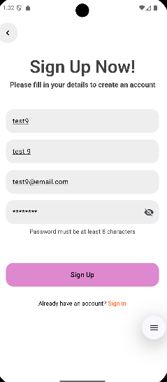 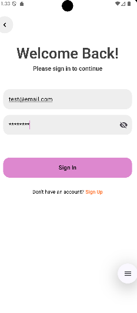

# Navigating The Home Page
After signing up / logging in, you will be directed to the home screen of the app. This is a Google maps interface which will show events from around the world (based on their visibility settings) that satisfy your current event filters. Events are shown as markers on the maps interface. There are 3 types of event markers which correspond to that event's visibility:
- Red markers represent public events
- Blue markers represent follower only events
- Orange markers represent friend only events (both you and the event host must follow each other)

Clicking on an event marker will open a modal allowing you to RSVP to it and view details like occupancy and cost.

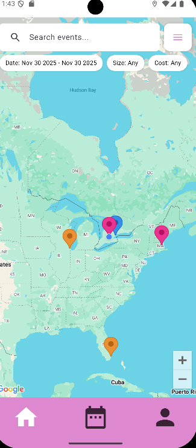 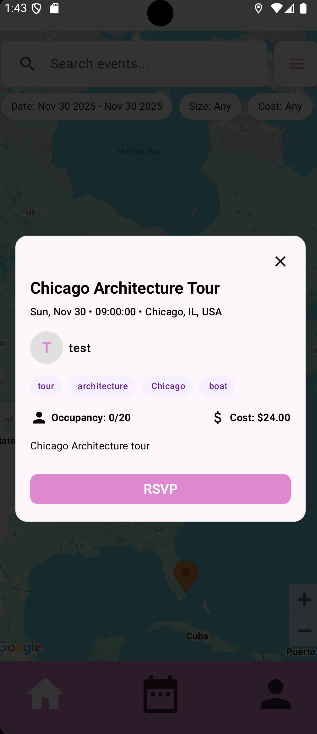

You can even filter by events by clicking the hamburger icon on the top right and entering your desired preferences (i.e. start/end date, group size, and cost). Click `Save` to apply those preferences. This will then only show events on the map which satisfy your preferences. Furthermore, you can search for events by typing in the search bar on the top, and typing for particular event names or tags.

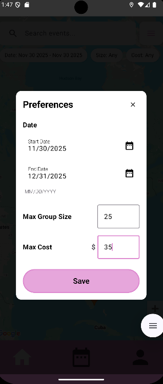 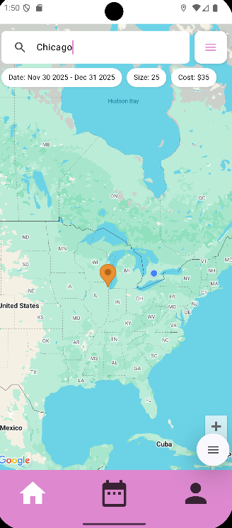

# Creating and Updating Events

On the bottom bar, click the middle icon to navigate to the `Your Events` screen. This is where you can see all the events that you have/are hosting. Once again, you have the hamburger icon near the top right to filter events based on preferences.

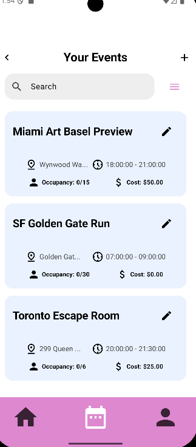

To create a new event, click the `+` button on the top right. You will be redirected to the `Create Event` screen and you will many fields that must be filled out (i.e. event name, location, max attendees, estimated cost, visibility, etc). Enter your desired values and then press the `Create Event` button at the bottom to create this event. This action will result in the map screen being updated to show your event, as well as show this event in the `Your Events` screen and on the `Profile` screen.

 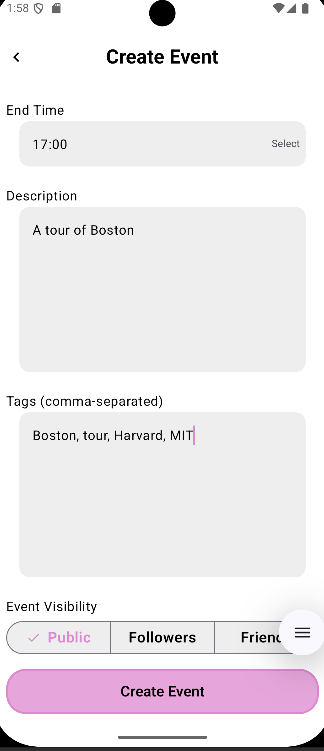 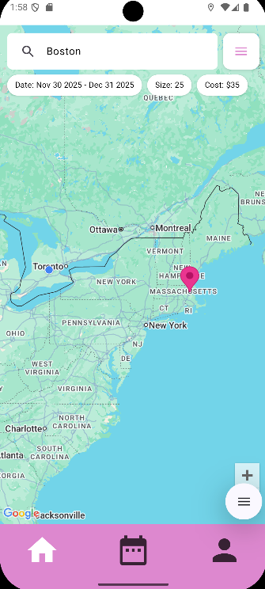

To edit an event, press the pencil icon on the top right of an event card in the `Your Events` screen and then edit whatever field(s) you desire. Click the `Edit Event` button at the bottom to save and register your changes. This will only work if the event you intend to edit is hosted by you. Otherwise, you will not see a pencil icon at all.

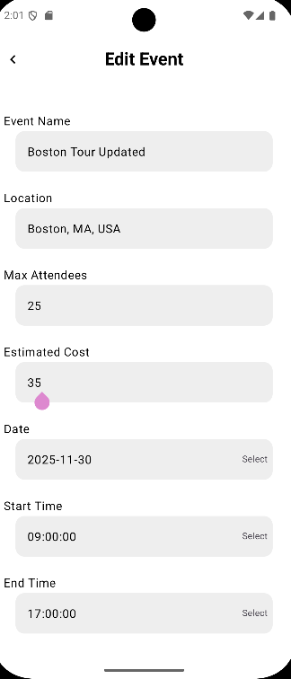

# Viewing Event Attendees
From the map screen, `Your Events` screen or the `Profile` screen, click on an event to open a modal. Click the `Occupancy:` text where it shows how many people RSVP'd to the event. Doing so will open up an `Attendees` screen showing all users who are RSVP'd. You can even search users by name and follow/unfollow users.

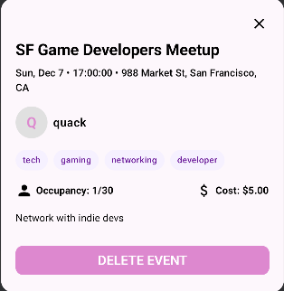 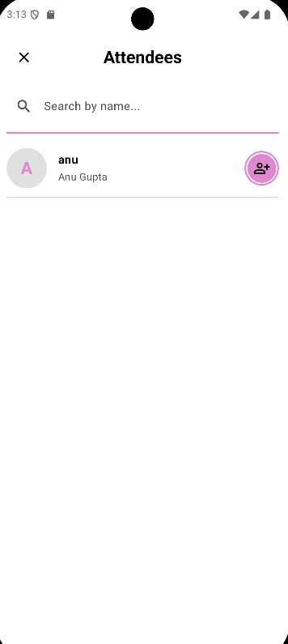

# Viewing and Editing Your Profile
Click the rightmost button on the bottom bar to navigate to the `Profile` screen. Here, you can view your profile information, such as the number of followers, following, hosted events, and attended events. You can even see the events that you have hosted and are attending, and can click on them to open a modal allowing you to view more details. This is also the screen where you can logout from.

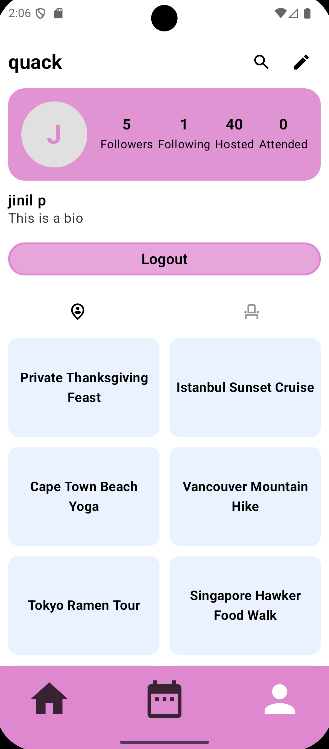 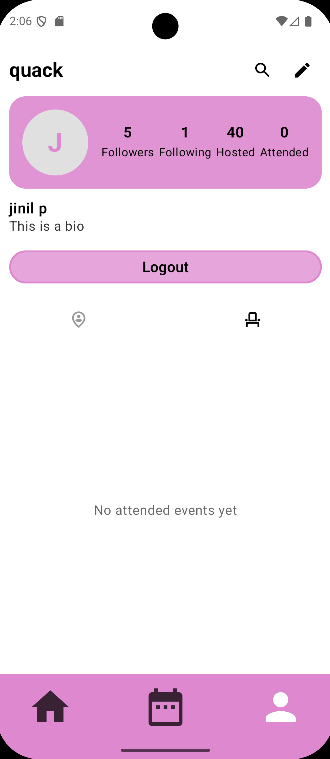

To edit your full name or your bio, press the pencil icon on the top right. This will open the `Edit Profile` screen and be able to edit those details. Click the `Save` button on the top right to save and register your changes.

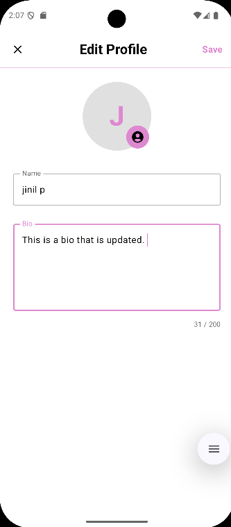

# Searching For Users, Viewing User Profiles, and Following Users

By clicking the search icon near the top right of the `Profile` screen, you will be able to see a list of all the users of this app. You can use the search bar at the top to search by name of a particular user you are interested in.

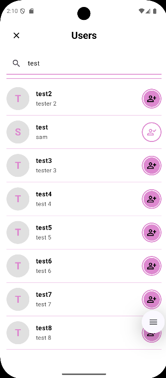

To follow a user, click the follow button on the right; it should change its appearance. To unfollow, click the same button again.

To view a profile, click on the profile picture of a particular user. You will be directed to their profile screen and view their stats and info. You can also view their hosted and attended events. There is also a `Follow` button on the different user's profile which you can click to follow.
Note: You can also access a user's profile page from the map screen by opening up an event's modal and clicking the profile picture of the event host.

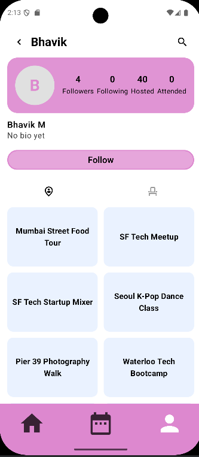

If you want to just view users that are your followers, or users that you are following, you can click the `Followers` or `Following` text on your `Profile` screen and view a list of such users. Note: You can also do this for other users as well.

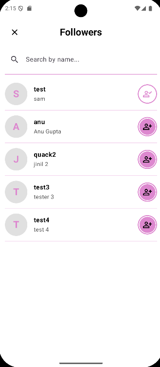 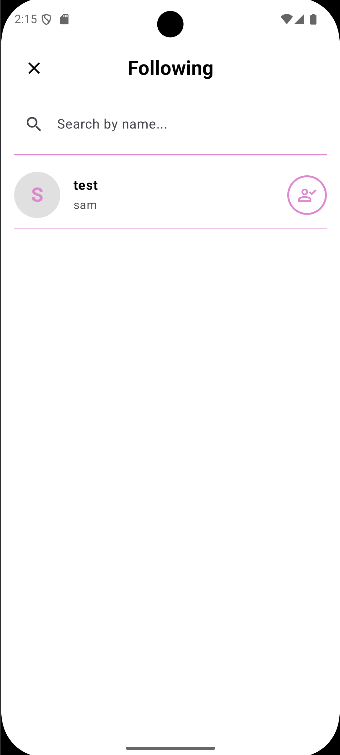

# RSVP / Leave / Delete Events
You can only RSVP / leave / delete events that have not been expired.
There are 4 ways to RSVP / leave / delete events.
- From the home map screen, you can click an event marker and when a modal opens up,  click `RSVP`. Similarly to leave an event, click the event marker which you have RSVP'd to, and click `LEAVE EVENT`. If the event was your own hosted event, there will be an option to `DELETE EVENT`, provided that the event has not expired already.

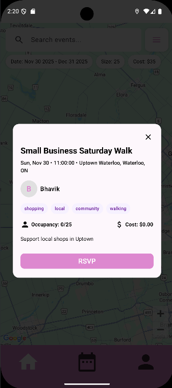 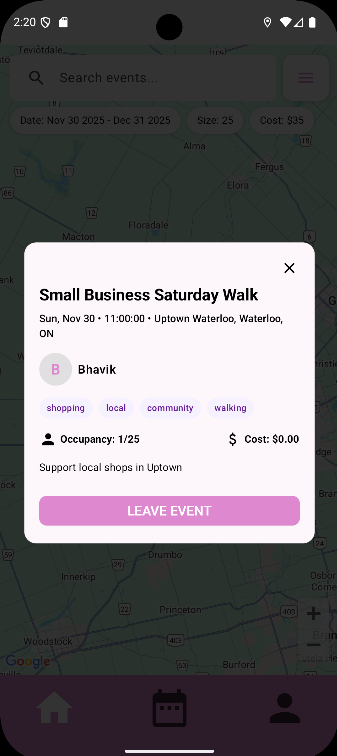 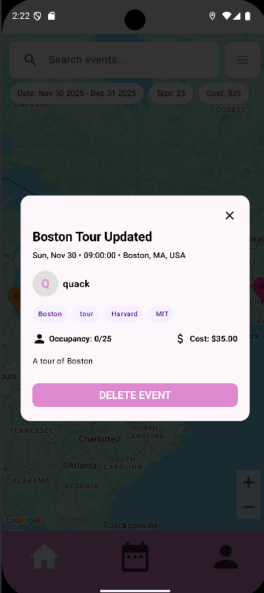

- From the `Your Events` screen, you can view events that you hosted, and events that you have RSVP'd to. Clicking on your own event will allow you to delete it, and clicking on an RSVP'd event will allow you to leave.

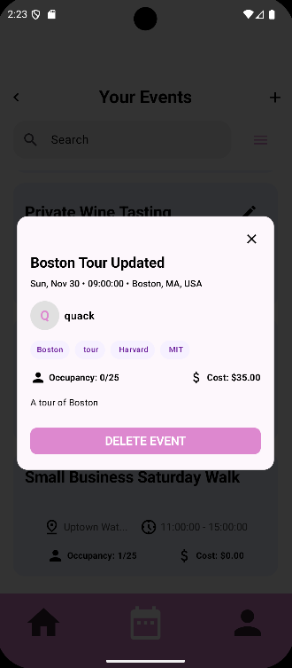 

- From the `Profile` screen, you can view your hosted events, and events that you have RSVP'd to. Clicking on your own event will allow you to delete it, and clicking on an RSVP'd event will allow you to leave.

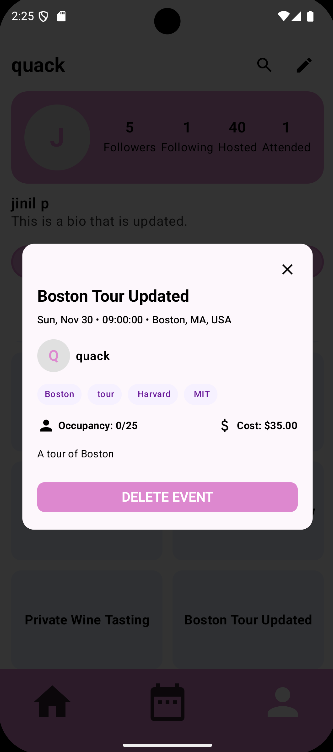 

- If you go onto another user's profile screen, you can view their hosted and attending events. Some events that a user may create are for followers or friends only to RSVP to. Clicking on your own event will allow you to delete it, and clicking on an RSVP'd event will allow you to leave.

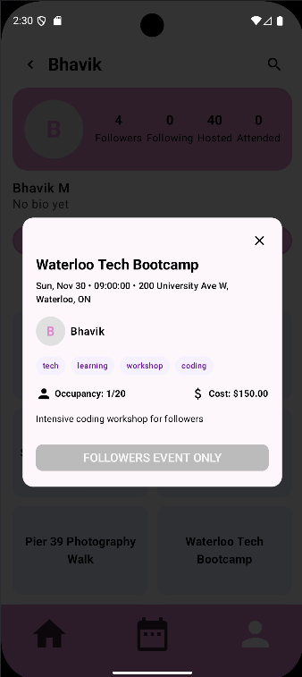 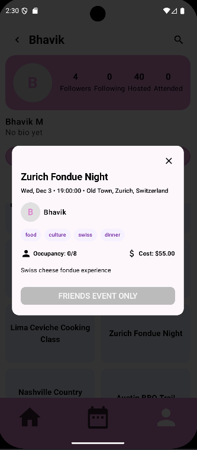

# Log Out
To log out of your account and/or login with a new user, go to your `Profile` screen and click the `Logout` button under your bio. This will redirect you to the `Welcome` screen, where you can login or sign up with a new account.
